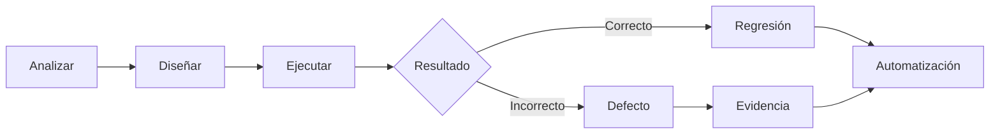
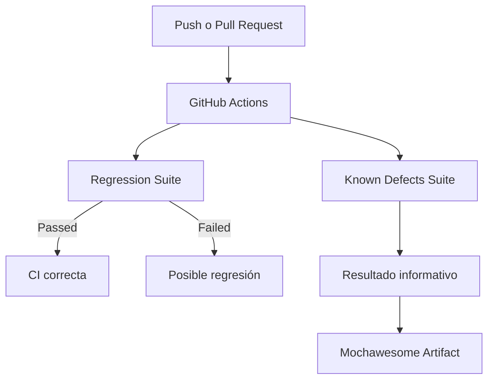
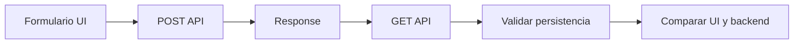
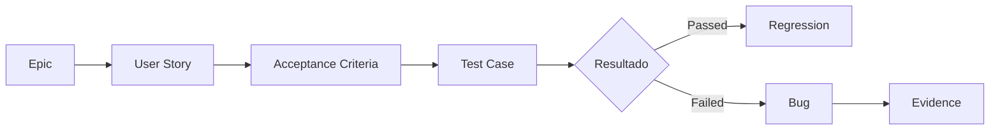

<div align="center">

# 🏨 Shady Meadows B&B — QA Portfolio

### Manual Testing · API Testing · E2E · Cypress · Maestro · CI/CD

Proyecto práctico de Quality Assurance sobre una aplicación web real.

🌐 [Ver aplicación](https://automationintesting.online/)  
⚙️ [Ver ejecuciones de GitHub Actions](https://github.com/MichaelR21z/shady-meadows-bnb-automation/actions)

[](https://github.com/MichaelR21z/shady-meadows-bnb-automation/actions/workflows/cypress.yml)

</div>

---

## 👋 Sobre el proyecto

Este repositorio forma parte de mi portafolio como **QA Tester**.

El objetivo es mostrar un proceso de calidad completo: analizar una funcionalidad, diseñar pruebas, ejecutarlas, documentar defectos y automatizar los escenarios que aportan valor a la regresión.

El proyecto combina pruebas manuales y automatizadas sobre la aplicación **Restful Booker Platform — Shady Meadows B&B**.



---

## 📊 Resultados actuales

| Métrica | Resultado |
| --- | ---: |
| Tests de regresión | **26 Passed** |
| Escenarios automatizados de defectos conocidos | **11** |
| Specs de regresión | **5** |
| Specs de defectos conocidos | **5** |
| Bugs documentados | **12** |
| Vulnerabilidades detectadas por npm | **0** |
| Integración continua | **GitHub Actions** |
| Reportes | **Mochawesome HTML** |

La regresión y los defectos conocidos se ejecutan por separado:

```text
Regression Suite
26 Passed · Bloqueante

Known Defects Suite
11 escenarios · No bloqueante
```

Esto permite diferenciar una regresión nueva de un defecto que ya está identificado y documentado.

---

## 🧠 Habilidades aplicadas

| Área | Aplicación en el proyecto |
| --- | --- |
| **Manual Testing** | Exploración, diseño y ejecución de Test Cases |
| **UI Testing** | Navegación, formularios, habitaciones, imágenes y contenido |
| **E2E Testing** | Flujos completos desde la interfaz hasta el backend |
| **API Testing** | Validación de status codes, responses y persistencia |
| **Integration Testing** | Comparación entre los datos de API y la información mostrada en UI |
| **Negative Testing** | Datos inválidos, recursos ausentes y respuestas inesperadas |
| **Boundary Testing** | Valores mínimos, máximos y fuera de límite |
| **Error Simulation** | Simulación controlada de respuestas HTTP 404, 409 y 500 |
| **Responsive Testing** | Validaciones en diferentes viewports |
| **Mobile Testing** | Flujos sobre Safari y simuladores iOS con Maestro |
| **Regression Testing** | Suite estable ejecutada automáticamente |
| **Bug Reporting** | Defectos reproducibles con evidencia y trazabilidad |
| **CI/CD** | Ejecución automática con GitHub Actions |
| **Test Reporting** | Reportes HTML mediante Mochawesome |

---

## 🧪 Cobertura funcional

### Homepage y branding

- Información pública del hotel.
- Datos de contacto.
- Logo e imagen principal.
- Ubicación y mapa.
- Consistencia entre UI y `GET /api/branding`.
- Respuestas incompletas del servicio de branding.

### Habitaciones

- Visualización del catálogo.
- Correspondencia entre UI y `GET /api/room`.
- Identificadores únicos.
- Información incompleta.
- Catálogo vacío.
- Acceso al flujo de reserva.
- Validación de imágenes.

### Formulario de contacto

- Envío con datos válidos.
- Correspondencia entre request y formulario.
- Persistencia del mensaje en backend.
- Campos obligatorios.
- Formatos inválidos.
- Valores límite.
- Respuestas HTTP 400 y 500.
- Feedback mostrado al usuario.

### Navegación y enlaces

- Navegación desde el header.
- Navegación desde el footer.
- Anchors y secciones internas.
- Enlaces sociales.
- Rutas inexistentes.
- Comportamiento responsive.

---

## 🧰 Herramientas

| Herramienta | Uso |
| --- | --- |
| **Cypress** | Automatización web, E2E, API e integración |
| **JavaScript** | Implementación de tests, utilidades y Page Objects |
| **Maestro** | Pruebas mobile y responsive en simuladores iOS |
| **Postman** | Exploración de APIs, validación y evidencia |
| **Jira** | Organización de épicas, historias, casos y defectos |
| **GitHub Actions** | Integración continua |
| **Mochawesome** | Reportes HTML de las ejecuciones |
| **Git / GitHub** | Control de versiones y publicación del proyecto |

---

## 🏗️ Arquitectura de la automatización

```text
cypress/
├── e2e/
│   ├── public/
│   │   └── homepage/
│   │       ├── branding.cy.js
│   │       ├── contact.cy.js
│   │       ├── images.cy.js
│   │       ├── navigation.cy.js
│   │       └── rooms.cy.js
│   │
│   └── known-defects/
│       └── homepage/
│           ├── branding-defects.cy.js
│           ├── contact-defects.cy.js
│           ├── links-defects.cy.js
│           ├── navigation-defects.cy.js
│           └── rooms-defects.cy.js
│
├── fixtures/
└── support/
    ├── pages/
    ├── utils/
    ├── commands.js
    └── e2e.js
```

La automatización utiliza:

- Page Objects;
- comandos reutilizables;
- datos dinámicos;
- interceptación de requests;
- simulación de respuestas;
- consultas API con `cy.request()`;
- variables de entorno;
- validaciones UI ↔ API.

---

## ✅ Regresión y defectos conocidos

### Regression Suite

Contiene los escenarios estables que deben pasar.

```text
cypress/e2e/public/homepage/
```

Si uno de estos tests falla en CI, la ejecución se marca como fallida porque puede existir una regresión nueva.

### Known Defects Suite

Contiene escenarios que reproducen comportamientos incorrectos ya identificados.

```text
cypress/e2e/known-defects/homepage/
```

Estos tests mantienen el resultado esperado del producto. No se modifican para aceptar el comportamiento defectuoso.

La suite se ejecuta en CI para:

- confirmar que el defecto sigue siendo reproducible;
- conservar evidencia automatizada;
- detectar cuándo el comportamiento cambia;
- evitar que los defectos conocidos bloqueen la regresión estable.



---

## 🔌 Pruebas de API e integración

Cypress utiliza `cy.request()` para validar directamente los servicios cuando la API forma parte del flujo automatizado.

Las comprobaciones incluyen:

- códigos HTTP;
- estructura de responses;
- datos enviados desde la interfaz;
- datos almacenados en backend;
- IDs obtenidos dinámicamente;
- correspondencia entre API y UI;
- manejo de errores.

Ejemplo del flujo de validación:



Postman se utiliza como herramienta complementaria para explorar endpoints, investigar defectos y generar evidencias.

La colección Postman y su ejecución mediante Newman forman parte de próximas mejoras.

---

## 🎭 Simulación de errores

Para reproducir escenarios difíciles de generar manualmente se utilizan interceptaciones controladas.

Ejemplos:

| Simulación | Objetivo |
| --- | --- |
| Branding sin objeto `map` | Validar el comportamiento ante una respuesta incompleta |
| Catálogo de habitaciones vacío | Validar el empty state |
| Imagen con respuesta 404 | Comprobar la estabilidad de la homepage |
| Servicio de contacto con HTTP 500 | Validar el feedback ante errores |
| Datos con formatos inválidos | Comprobar validaciones frontend y backend |

Estas simulaciones permiten ejecutar los escenarios de forma repetible sin depender de que el error ocurra de manera natural.

---

## 📱 Mobile y responsive

Maestro complementa la automatización web cuando el comportamiento depende del dispositivo o del viewport.

```text
maestro/
└── flows/
    └── navigation-responsive.yaml
```

Actualmente se utiliza para validar:

- apertura del menú mobile;
- opciones disponibles;
- navegación mediante el menú;
- comportamiento después de seleccionar una sección;
- visualización en simuladores iOS.

---

## 📝 Documentación QA

La documentación se mantiene dentro del repositorio para que el proyecto pueda entenderse sin acceso a herramientas externas.

```text
docs/
├── epics/
├── test-cases/
├── bugs/
├── evidence/
└── test-strategy.md
```

| Ruta | Contenido |
| --- | --- |
| `docs/epics/` | Objetivo, alcance y valor de negocio |
| `docs/test-cases/` | Casos, criterios de aceptación y resultados |
| `docs/bugs/` | Defectos encontrados |
| `docs/evidence/` | Capturas asociadas a defectos |
| [`docs/test-strategy.md`](docs/test-strategy.md) | Estrategia general del proyecto |

La trazabilidad utilizada es:



---

## 🐞 Bug reporting

Los defectos documentados incluyen:

- descripción;
- trazabilidad;
- precondiciones;
- datos de prueba;
- pasos para reproducir;
- resultado actual;
- resultado esperado;
- severidad y prioridad;
- entorno;
- evidencias;
- recomendación.

Ejemplos:

- [`SMB-110 — Missing branding object`](docs/bugs/SMB-1/SMB-110-missing-branding-object.md)
- [`SMB-134 — Empty room state`](docs/bugs/SMB-1/SMB-134-empty-room-state.md)
- [`SMB-42 — Contact form accepts invalid data`](docs/bugs/SMB-2/SMB-42-contact-form-accepts-invalid-data.md)
- [`SMB-155 — Contact form without error feedback`](docs/bugs/SMB-2/SMB-155-contact-form-no-error-feedback.md)

---

## 🚀 Instalación

### Requisitos

- Node.js
- npm
- Git
- Chrome

### Clonar el repositorio

```bash
git clone https://github.com/MichaelR21z/shady-meadows-bnb-automation.git
cd shady-meadows-bnb-automation
```

### Instalar dependencias

```bash
npm ci
```

---

## 🧪 Ejecutar las pruebas

### Regresión estable

```bash
npm test
```

También puede ejecutarse mediante:

```bash
npm run test:regression
```

### Defectos conocidos

```bash
npm run test:defects
```

Esta suite contiene escenarios que pueden fallar de forma esperada mientras los defectos continúen abiertos.

---

## 📊 Reportes

Cada ejecución genera un reporte HTML con Mochawesome:

```text
cypress/reports/index.html
```

Para abrir el último reporte en macOS:

```bash
npm run report:open
```

El reporte incluye:

- tests ejecutados;
- Passed y Failed;
- duración;
- suites;
- errores;
- screenshots asociados a fallos.

Los reportes y screenshots son temporales y no se almacenan en Git.

En GitHub Actions se generan dos artifacts independientes:

```text
regression-mochawesome-report
known-defects-mochawesome-report
```

Los artifacts se conservan durante dos días.

---

## ⚙️ Integración continua

GitHub Actions ejecuta automáticamente las pruebas después de:

- un `push` a `main`;
- un Pull Request hacia `main`;
- una ejecución manual.

El workflow contiene dos jobs:

| Job | Comportamiento |
| --- | --- |
| **Public Homepage Regression** | Bloqueante |
| **Known Defects** | Informativo y no bloqueante |

De esta manera, CI puede detectar regresiones nuevas sin perder visibilidad sobre los defectos que ya están documentados.

---

## 🔐 Variables de entorno

Las credenciales no se almacenan directamente en los tests.

Para desarrollo local se utiliza:

```text
cypress.env.json
```

Este archivo está excluido mediante `.gitignore`.

El repositorio incluye:

```text
cypress.env.example.json
```

como referencia.

Las variables sensibles se obtienen mediante `cy.env()`:

```javascript
cy.env(['adminUsername', 'adminPassword']).then(
    ({ adminUsername, adminPassword }) => {
        // Use credentials securely.
    }
)
```

En GitHub Actions se utilizan Repository Secrets.

---

## 🗺️ Estado del proyecto

El proyecto se desarrolla progresivamente mediante áreas funcionales identificadas con `SMB-*`.

### Cobertura funcional

| Área | Funcionalidades incluidas | Estado |
| --- | --- | --- |
| **SMB-1** | Homepage pública, branding, navegación, catálogo de habitaciones, imágenes, enlaces y responsive | ✅ Desarrollado |
| **SMB-2** | Formulario de contacto, validaciones, valores límite, persistencia y manejo de errores | ✅ Desarrollado |
| **SMB-3** | Disponibilidad, fechas y flujo de reservas | 🚧 En desarrollo |
| **SMB-4** | Login, sesiones, logout, tokens y rutas administrativas protegidas | 🚧 En desarrollo |
| **SMB-8** | Reportes administrativos y ocupación | ⏳ Próxima entrega |

### Capacidades del proyecto QA

| Capacidad | Estado |
| --- | --- |
| Regresión automatizada | ✅ Desarrollada |
| Defectos conocidos separados | ✅ Desarrollados |
| Validaciones UI ↔ API | ✅ Desarrolladas |
| Simulación de errores HTTP | ✅ Desarrollada |
| Pruebas mobile con Maestro | ✅ Desarrolladas |
| CI con ejecuciones separadas | ✅ Desarrollada |
| Reportes Mochawesome independientes | ✅ Desarrollados |
| Accesibilidad automatizada | 🧪 En investigación |
| Colección Postman y Newman | ⏳ Próxima mejora |

---

## 👨‍💻 Autor

**Michael Romero**  
QA Tester · ISTQB® Certified Tester Foundation Level

💼 [LinkedIn](https://www.linkedin.com/in/michaelsromero/)  
📧 [Michaelromevi@gmail.com](mailto:Michaelromevi@gmail.com)

---

<div align="center">

### Shady Meadows B&B QA Portfolio

**Manual · Web · Mobile · API · E2E · Cypress · Maestro · CI/CD**

🚧 Proyecto en desarrollo continuo

</div>