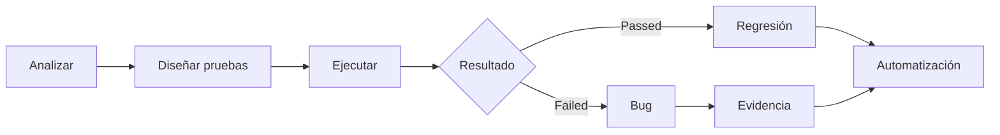
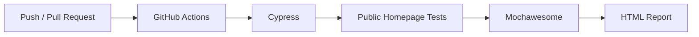
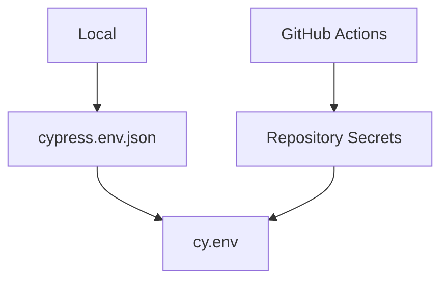
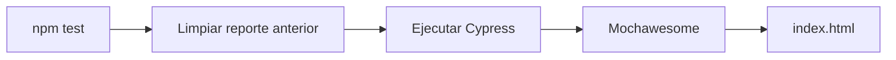
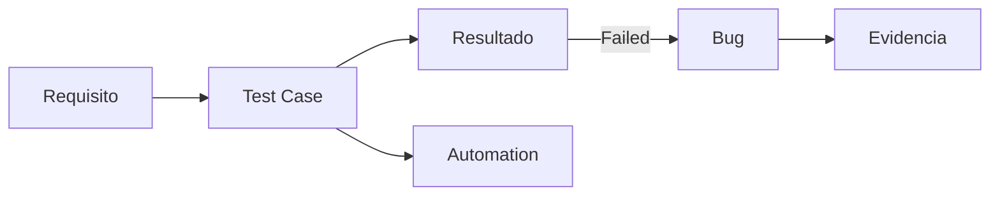
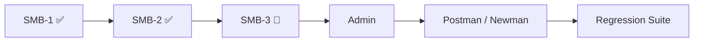

<div align="center">

# 🏨 Shady Meadows B&B — QA Portfolio

### Manual Testing · API Testing · Cypress · Maestro · CI

Proyecto práctico de Quality Assurance desarrollado sobre  
**Restful-booker-platform / Shady Meadows B&B**

`https://automationintesting.online/`

</div>

---

## 👋 Sobre el proyecto

Este repositorio forma parte de mi portfolio de **Quality Assurance**.

El objetivo es aplicar un proceso QA completo sobre una aplicación web real:



El proyecto combina pruebas manuales y automatizadas para validar la aplicación desde diferentes niveles.

| Área | Uso |
| --- | --- |
| 🌐 UI Testing | Navegación, formularios, habitaciones y comportamiento visual |
| 🔄 E2E | Flujos completos desde la interfaz |
| 🔌 API Testing | Status codes, responses, datos y persistencia |
| ❌ Negative Testing | Errores, datos inválidos y comportamientos inesperados |
| 📐 Boundary Testing | Valores mínimos y máximos |
| 📱 Mobile / Responsive | Validaciones sobre diferentes dispositivos |
| 🤖 Automation | Regresión automatizada con Cypress y Maestro |
| 📋 Bug Reporting | Defectos documentados con evidencias |
| ⚙️ CI | Ejecución automática mediante GitHub Actions |

---

# 🛠️ Herramientas

### Cypress

Herramienta principal de automatización web.

Se utiliza para:

- pruebas funcionales;
- E2E;
- formularios;
- navegación;
- interceptación de requests;
- simulación de errores;
- validaciones UI ↔ API;
- consultas con `cy.request()`;
- pruebas negativas y de límites.

La automatización utiliza **Page Objects**, utilidades reutilizables y datos dinámicos.

---

### Maestro

Utilizado para escenarios mobile y responsive, principalmente sobre simuladores iOS.

```text
maestro/
└── flows/
```

Permite complementar Cypress cuando el comportamiento depende especialmente del dispositivo o del viewport.

---

### Postman

Postman se utiliza como herramienta de apoyo durante las pruebas API.

Actualmente se usa para:

- ejecutar requests;
- validar status codes;
- inspeccionar responses;
- comprobar estructuras;
- verificar persistencia;
- investigar defectos;
- generar evidencias API.

> La colección Postman versionada y su posterior ejecución con Newman forman parte de próximas entregas del proyecto.

---

### Jira

Utilizado para organizar User Stories, Test Cases, resultados y defectos.

La documentación principal también se mantiene dentro del repositorio para que el proyecto pueda entenderse sin acceso externo a Jira.

---

### GitHub Actions

GitHub Actions ejecuta automáticamente la suite Cypress configurada para CI después de cambios en el repositorio.

Actualmente el workflow está enfocado en:

```text
cypress/e2e/public/homepage/
```



Las áreas Booking y Admin se incorporarán progresivamente a CI a medida que avance su cobertura.

---

### Mochawesome

Cada ejecución Cypress genera un reporte HTML visual con:

- tests ejecutados;
- Passed / Failed;
- duración;
- suites;
- errores;
- screenshots asociados a fallos.

En GitHub Actions el reporte se guarda como un **artifact temporal durante 2 días**.

No se almacena permanentemente dentro del repositorio.

---

# 📂 Estructura principal

```text
ShadyMeadowsB&B/
│
├── cypress/
│   ├── e2e/
│   │   ├── public/
│   │   │   └── homepage/
│   │   ├── booking/
│   │   └── admin/
│   │
│   ├── support/
│   │   ├── pages/
│   │   ├── utils/
│   │   ├── commands.js
│   │   └── e2e.js
│   │
│   └── fixtures/
│
├── maestro/
│   └── flows/
│
├── docs/
│   ├── test-cases/
│   ├── bugs/
│   ├── evidence/
│   └── test-strategy.md
│
├── .github/
│   └── workflows/
│       └── cypress.yml
│
├── cypress.env.example.json
├── cypress.config.js
├── package.json
└── README.md
```

### ¿Qué contiene cada parte?

| Ruta | Contenido |
| --- | --- |
| `cypress/e2e/` | Tests automatizados organizados por área funcional |
| `cypress/support/pages/` | Page Objects |
| `cypress/support/utils/` | Funciones reutilizables |
| `maestro/flows/` | Flujos mobile y responsive |
| `docs/test-cases/` | Diseño y resultados de pruebas |
| `docs/bugs/` | Defectos encontrados |
| `docs/evidence/` | Evidencias asociadas a los bugs |
| `docs/test-strategy.md` | Estrategia general de testing |
| `.github/workflows/` | Integración continua |

---

# 🧩 Cobertura funcional

El proyecto se desarrolla progresivamente por áreas identificadas mediante `SMB-*`.

| Área | Funcionalidad | Estado |
| --- | --- | --- |
| **SMB-1** | 🌐 Homepage pública y habitaciones | ✅ Desarrollado |
| **SMB-2** | ✉️ Formulario de contacto | ✅ Desarrollado |
| **SMB-3** | 📅 Disponibilidad y reservas | 🚧 En curso |
| **SMB-4** | 🔐 Autenticación administrativa | ⏳ Próxima entrega |
| **SMB-8** | 📊 Reports / ocupación | ⏳ Próxima entrega |

### SMB-1

Validación de la experiencia pública:

- navegación;
- información del hotel;
- habitaciones;
- imágenes;
- enlaces;
- responsive.

**Herramientas:** Cypress + Maestro

### SMB-2

Validación del formulario de contacto:

- envío;
- persistencia;
- campos obligatorios;
- formatos inválidos;
- valores límite;
- manejo de errores;
- feedback al usuario.

**Herramienta principal:** Cypress

### SMB-3

Cobertura relacionada con:

- disponibilidad;
- fechas;
- reservas;
- validaciones;
- integración UI ↔ API.

🚧 **En curso**

### SMB-4

Cobertura administrativa relacionada con:

- login;
- sesiones;
- logout;
- credenciales;
- tokens;
- rutas protegidas.

⏳ **Próxima entrega**

---

# 🔐 Variables de entorno

Las credenciales y otros datos sensibles no se almacenan directamente en los tests.

Para desarrollo local se utiliza:

```text
cypress.env.json
```

Este archivo está incluido en `.gitignore`.

El repositorio contiene únicamente:

```text
cypress.env.example.json
```

con valores de ejemplo:

```json
{
  "adminUsername": "your-username",
  "adminPassword": "your-password"
}
```

Los tests acceden a estas variables mediante:

```javascript
cy.env(['adminUsername', 'adminPassword']).then(
  ({ adminUsername, adminPassword }) => {
    // Use credentials securely
  }
)
```

En GitHub Actions los valores reales se almacenan mediante **Repository Secrets**.



---

# 🚀 Instalación

## 1. Clonar el repositorio

```bash
git clone <repository-url>
cd ShadyMeadowsB&B
```

## 2. Instalar dependencias

```bash
npm install
```

## 3. Configurar variables locales

Crea:

```text
cypress.env.json
```

tomando como referencia:

```text
cypress.env.example.json
```

---

# 🧪 Ejecutar las pruebas

### Toda la suite Cypress

```bash
npm test
```

### Solo Public / Homepage

```bash
npm run test:public
```

Este segundo comando es útil mientras se trabaja sobre la cobertura pública actual.

---

# 📊 Reportes Mochawesome

Al ejecutar Cypress se genera automáticamente:

```text
ccypress/reports/index.html
```

Para abrir el último reporte en macOS:

```bash
npm run report:open
```

Antes de una nueva ejecución se eliminan:

```text
cypress/reports/
cypress/screenshots/
```

Por lo tanto, localmente se conserva únicamente la información correspondiente a la ejecución más reciente.



Los reportes y screenshots están incluidos en `.gitignore`, por lo que **no se versionan**.

---

# ⚙️ Continuous Integration

El workflow:

```text
.github/workflows/cypress.yml
```

ejecuta Cypress automáticamente mediante GitHub Actions.

Actualmente:

```text
Push / Pull Request
        ↓
GitHub Actions
        ↓
Public Homepage
        ↓
Cypress
        ↓
Mochawesome
        ↓
HTML Artifact
        ↓
Eliminación automática después de 2 días
```

Esto permite detectar regresiones y revisar los resultados de las ejecuciones sin almacenar reportes permanentemente en el repositorio.

---

# 📝 Documentación QA

La documentación está separada del código de automatización:

```text
docs/
├── test-cases/
├── bugs/
├── evidence/
└── test-strategy.md
```

La relación general es:



`test-strategy.md` describe el enfoque general utilizado para decidir **qué probar, cómo probarlo y qué automatizar**.

---

# 🚧 Estado del proyecto

> **Proyecto en curso**
>
> La cobertura se amplía progresivamente a nuevas funcionalidades de la aplicación.

Próximas entregas incluyen:

- ampliación de Booking;
- autenticación y funcionalidades administrativas;
- incorporación progresiva de nuevas suites a CI;
- colección Postman versionada;
- Newman;
- ampliación de regresión automatizada.



---

# 👨‍💻 Contacto

**Michael Romero**  
QA Tester · ISTQB® Certified Tester Foundation Level

💼 [LinkedIn](https://www.linkedin.com/in/michaelsromero/)

📧 [Michaelromevi@gmail.com](mailto:Michaelromevi@gmail.com)

---

<div align="center">

### Shady Meadows B&B QA Portfolio

**Manual · API · Cypress · Maestro · GitHub Actions · Mochawesome**

🚧 Continuous development

</div>