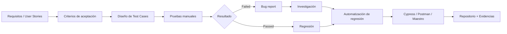
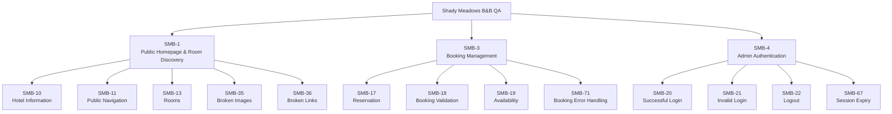
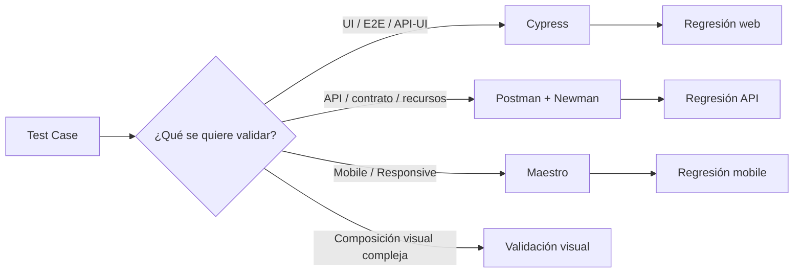
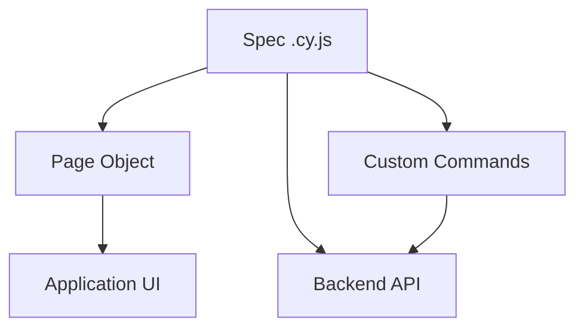
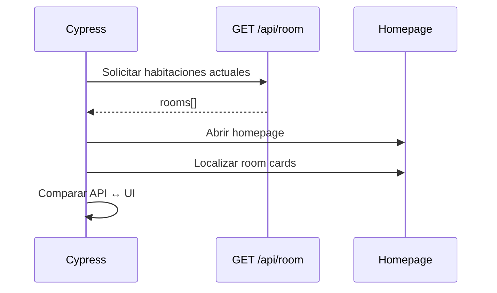
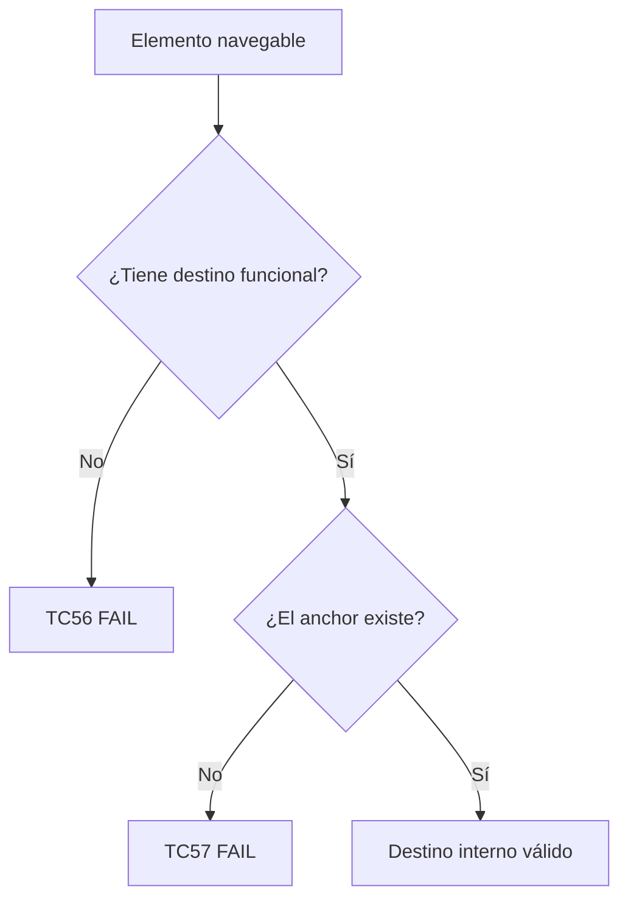
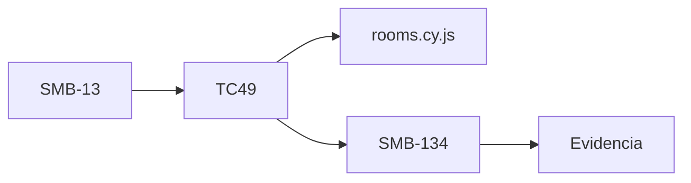

# 🧪 Portafolio QA — Shady Meadows B&B Testing

> Proyecto de QA funcional, API, E2E y mobile construido sobre [automationintesting.online](https://automationintesting.online/) como entorno público de práctica para simular un proceso de calidad de software de principio a fin.

<p align="center">
  
  
  
  
  
  
  
</p>

---

## 📌 Sobre este proyecto

Este repositorio documenta un proceso de QA aplicado sobre una aplicación real de reservas de hotel. El objetivo no es únicamente almacenar scripts de automatización, sino mostrar cómo se aborda la calidad desde una perspectiva completa:

- análisis funcional;
- diseño de Test Cases;
- pruebas positivas, negativas y edge cases;
- testing de APIs;
- automatización E2E web;
- automatización responsive/mobile;
- validaciones API ↔ UI;
- inyección controlada de errores;
- reporte y trazabilidad de bugs;
- investigación de causa raíz;
- evidencias de ejecución;
- organización mantenible del repositorio.

El flujo de trabajo busca representar un proceso similar al de un equipo real:



---

## 🎯 Objetivos del portfolio

Este proyecto busca demostrar experiencia práctica en:

| Área | Aplicación en el proyecto |
|---|---|
| QA Manual | Diseño, ejecución y documentación de Test Cases |
| E2E Web | Cypress |
| API Testing | Postman / Newman |
| Mobile / Responsive | Maestro + simuladores iOS |
| API ↔ UI | Comparaciones dinámicas usando respuestas reales del backend |
| Negative Testing | `cy.intercept()`, estados vacíos, datos incompletos, HTTP errors |
| Bug Reporting | Jira + documentación Markdown |
| Root Cause Analysis | Investigación de disponibilidad, sesión, errores de backend |
| Test Design | Partición de equivalencia, valores límite, transición de estados, checklist |
| Arquitectura | POM, Custom Commands, helpers y separación por responsabilidad |
| Versionado | Git / GitHub |

---

# 🧭 Cobertura funcional

Actualmente el proyecto está organizado por Epics y User Stories.



> La disponibilidad por fechas pertenece a **SMB-19 / SMB-3**. Se eliminó la duplicidad que existía con SMB-101 en SMB-1.

---

# 🏠 SMB-1 — Public Homepage & Room Discovery

La homepage se valida desde varias perspectivas: contenido, navegación, habitaciones, imágenes, enlaces y responsive.

| User Story | Test Cases | Automatización principal |
|---|---|---|
| **SMB-10 — Información pública del hotel** | TC37–TC41 | Cypress / Postman |
| **SMB-11 — Navegación pública** | TC42–TC46 | Cypress / Maestro |
| **SMB-13 — Información de habitaciones** | TC47–TC51 | Cypress |
| **SMB-35 — Imágenes públicas** | TC52–TC55 | Cypress / Maestro |
| **SMB-36 — Enlaces públicos** | TC56–TC57 | Cypress |

### Estado actual de SMB-1

| TC | Objetivo | Estado / Herramienta |
|---|---|---|
| TC37 | Información pública visible | ✅ Cypress |
| TC38 | `/api/branding` ↔ UI | ✅ Cypress |
| TC39 | Branding sin autenticación | ✅ Postman |
| TC40 | Estructura de `/api/branding` | ✅ Postman |
| TC41 | Branding incompleto | ✅ Cypress — reproduce bug |
| TC42 | Navegación header | ✅ Cypress |
| TC43 | Visibilidad tras navegación | 🟡 Cypress + validación visual |
| TC44 | Ruta inexistente | ✅ Cypress |
| TC45 | Responsive navigation | ✅ Maestro |
| TC46 | Footer Quick Links | ✅ Cypress |
| TC47 | Catálogo de habitaciones | ✅ Cypress |
| TC48 | `/api/room` ↔ UI | ✅ Cypress |
| TC49 | Catálogo vacío | ✅ Cypress |
| TC50 | Información incompleta | ✅ Cypress |
| TC51 | Acceso al flujo de reserva | ✅ Cypress |
| TC52 | Imágenes públicas visibles | ✅ Cypress |
| TC53 | HTTP de recursos de imagen | ✅ Cypress |
| TC54 | Imagen 404 | ✅ Cypress |
| TC55 | Responsive images | 🟡 Maestro + revisión visual |
| TC56 | Destinos válidos | ✅ Cypress — reproduce bugs |
| TC57 | Anchors internos existentes | ⏳ Pendiente |

---

# 🏗️ Arquitectura del repositorio

```text
Shady-Meadows-b&b/
│
├── cypress/
│   ├── e2e/
│   │   ├── public/
│   │   │   └── homepage/
│   │   │       ├── branding.cy.js
│   │   │       ├── navigation.cy.js
│   │   │       ├── rooms.cy.js
│   │   │       ├── images.cy.js
│   │   │       └── links.cy.js
│   │   │
│   │   ├── booking/
│   │   │   ├── availability.cy.js
│   │   │   └── reservation.cy.js
│   │   │
│   │   └── admin/
│   │       ├── authentication.cy.js
│   │       ├── session.cy.js
│   │       ├── rooms.cy.js
│   │       └── reports.cy.js
│   │
│   ├── fixtures/
│   │
│   ├── screenshots/
│   │
│   ├── videos/
│   │
│   └── support/
│       ├── pages/
│       │   └── HomePage.js
│       ├── utils/
│       ├── commands.js
│       └── e2e.js
│
├── docs/
│   ├── epics/
│   ├── test-cases/
│   │   ├── SMB-1/
│   │   ├── SMB-3/
│   │   └── SMB-4/
│   ├── bugs/
│   ├── case-studies/
│   └── traceability-matrix.md
│
├── evidence/
│
├── postman/
│   ├── collections/
│   └── environments/
│
├── flows/
│   └── navigation-responsive.yaml
│
├── cypress.config.js
├── cypress.env.json
├── package.json
├── package-lock.json
├── .gitignore
└── README.md
```

---

# 🧩 Estrategia de automatización

La herramienta se selecciona según el tipo de riesgo que se quiere cubrir.



### Cypress

Se utiliza para:

- flujos E2E;
- validaciones API ↔ UI;
- navegación;
- componentes públicos;
- estados vacíos;
- datos incompletos;
- errores simulados;
- comprobación de recursos;
- regresión de bugs.

Ejemplos destacados:

```javascript
cy.request('GET', '/api/branding')
cy.request('GET', '/api/room')
cy.intercept('GET', '/api/room', ...)
cy.location('pathname')
cy.get(...).within(...)
```

### Postman / Newman

Se utiliza cuando el objetivo es principalmente API:

- endpoints públicos;
- autenticación;
- estructura de respuestas;
- tipos de datos;
- status codes;
- Content-Type;
- recursos HTTP.

### Maestro

Se utiliza para validar comportamiento responsive/mobile en simuladores Apple.

Dispositivos usados:

- iPhone 17 — iOS 26.5
- iPad Pro 11-inch (M5) — iOS 26.5

---

# 🧱 Page Object Model y Custom Commands

El proyecto utiliza POM de forma selectiva.



### Filosofía

```text
Page Objects
→ selectores UI
→ acciones
→ validaciones reutilizables

Custom Commands
→ autenticación
→ login API
→ preparación común

Fixtures / Utils
→ datos o transformaciones reutilizables

Specs
→ intención del Test Case
→ flujo
→ assertions
```

No se fuerza POM cuando añadir una abstracción no mejora legibilidad o mantenimiento.

---

# 🔄 API como fuente de verdad

Uno de los principios del proyecto es evitar hardcodear datos dinámicos.

Ejemplo conceptual:



Esto permite que los tests sigan siendo válidos aunque cambien:

- habitaciones;
- precios;
- imágenes;
- características;
- contenido de branding.

---

# 🧪 Negative Testing y Robustez

La suite no se limita al happy path.

Se simulan escenarios controlados mediante `cy.intercept()`:

```mermaid
flowchart LR
    A[Backend normal] --> B[cy.intercept]
    B --> C{Escenario}
    C --> D[rooms: []]
    C --> E[branding sin map]
    C --> F[imagen 404]
    C --> G[datos incompletos]
    D --> H[Validar estado vacío]
    E --> I[Validar robustez]
    F --> J[Validar continuidad UI]
    G --> K[Validar tolerancia a datos faltantes]
```

Ejemplos:

```javascript
cy.intercept('GET', '/api/room', {
    statusCode: 200,
    body: {
        rooms: []
    }
})
```

```javascript
cy.intercept('GET', '**/images/room1.jpg', {
    statusCode: 404,
    body: 'Not Found'
})
```

El objetivo es conseguir escenarios:

- deterministas;
- repetibles;
- independientes del estado temporal del entorno compartido.

---

# 🖼️ Validación de imágenes

La validación incluye:

1. imágenes visibles;
2. imágenes propias de la aplicación;
3. `background-image`;
4. recursos obtenidos desde APIs;
5. HTTP status;
6. `Content-Type`;
7. imágenes rotas;
8. responsive.

Para evitar falsos positivos se excluyen recursos externos como tiles del mapa cuando no forman parte del objetivo del Test Case.

Ejemplo:

```javascript
cy.get('img[src^="/images/"]')
```

Y para comprobar que la imagen cargó realmente:

```javascript
expect($element[0].naturalWidth)
    .to.be.greaterThan(0)
```

---

# 🔗 Validación de enlaces

SMB-36 comprueba dos riesgos diferentes.



### TC56

Detecta elementos como:

```html
<a href="#">Rooms</a>
```

### TC57

Detecta casos como:

```html
<a href="/#amenities">Amenities</a>
```

cuando no existe:

```html
id="amenities"
```

---

# 🐞 Bugs destacados encontrados

El proyecto incluye defectos descubiertos mediante pruebas manuales, Cypress, Postman y Maestro.

| ID | Hallazgo | Tipo |
|---|---|---|
| **SMB-110** | La homepage falla cuando falta un objeto principal de `/api/branding` | Robustez / Frontend |
| **SMB-119** | Amenities apunta a un anchor inexistente | Navegación |
| **SMB-120** | Booking queda parcialmente oculto por navbar sticky | UI / UX |
| **SMB-121** | Página 404 sin opciones claras de recuperación | UX / Routing |
| **SMB-122** | Menú hamburguesa permanece abierto y tapa contenido | Responsive |
| **SMB-123** | Mapa Location no se adapta correctamente en responsive | Responsive |
| **SMB-125** | Quick Links del footer usan destinos no funcionales | Navegación |
| **SMB-39** | Iconos sociales no redirigen a sus plataformas | Navegación |
| **SMB-38** | Pantalla de error al reservar con fechas inválidas | Booking |
| **SMB-46** | Reserva creada con datos inválidos | Validación |
| **SMB-53** | Fechas inválidas generan importe negativo | Booking / Edge Case |
| **SMB-72** | Check Availability muestra habitaciones ya reservadas | Disponibilidad |
| **SMB-73** | Error ante HTTP 409 Conflict en reserva | Error Handling |

> Los IDs se mantienen para conservar trazabilidad con Jira.

---

# 🔍 Ejemplos de trazabilidad



Otro ejemplo:

```text
User Story
SMB-36

↓
Test Case
TC56

↓
Automatización
links.cy.js

↓
Defectos reproducidos
SMB-125
SMB-39
```

---

# 📱 Evidencias mobile

Las ejecuciones de Maestro se documentan por:

- Test Case;
- dispositivo;
- flow;
- resultado;
- bug relacionado;
- vídeo/evidencia.

Ejemplo:

```text
TC45
→ navigation-responsive.yaml
→ iPhone 17 / iPad Pro 11"
→ Failed
→ SMB-122
→ evidencia en vídeo
```

Los vídeos se enlazan externamente para evitar aumentar innecesariamente el tamaño del repositorio.

---

# 📚 Convenciones de documentación

- Documentación y explicaciones: **español**.
- Código, variables y comentarios: **inglés**.
- Los títulos de `it()` pueden mantenerse en español por trazabilidad.
- Resultado satisfactorio: **Passed**.
- Si un Test Case reproduce un bug conocido: **Failed**.
- No se ocultan defectos para conseguir una suite artificialmente verde.
- Los Test Cases deben evitar valores hardcodeados cuando los datos son dinámicos.
- Jira es la fuente de gestión de bugs; Markdown permite mostrar el trabajo dentro del portfolio.

---

# 🔐 Seguridad y configuración local

Los secretos no deben subirse al repositorio.

Ejemplo:

```gitignore
node_modules/
cypress.env.json
.env
cypress/screenshots/
cypress/videos/
.DS_Store
```

`cypress.env.json` puede contener localmente:

```json
{
  "adminUsername": "",
  "adminPassword": ""
}
```

Nunca deben publicarse credenciales reales, tokens o cookies de sesión.

---

# ▶️ Cómo ejecutar el proyecto

## Instalar dependencias

```bash
npm install
```

## Cypress — modo interactivo

```bash
npx cypress open
```

## Cypress — headless

```bash
npx cypress run
```

## Ejecutar únicamente Homepage

```bash
npx cypress run --spec "cypress/e2e/public/homepage/**/*.cy.js"
```

## Postman / Newman

Ejemplo:

```bash
newman run postman/collections/automationintesting.postman_collection.json
```

Si se utiliza un environment:

```bash
newman run postman/collections/automationintesting.postman_collection.json \
  -e postman/environments/automationintesting.postman_environment.json
```

## Maestro

Ejecutar un flow:

```bash
maestro test flows/navigation-responsive.yaml
```

Ver simuladores activos:

```bash
xcrun simctl list devices | grep Booted
```

---

# 🧾 Case Studies

El portfolio puede incluir investigaciones más profundas además de Test Cases individuales.

### Disponibilidad y conflictos de reserva

Análisis de:

- disponibilidad real;
- habitaciones solapadas;
- HTTP 409;
- diferencias entre validación frontend y backend;
- reproducción determinista mediante automatización.

### Sesión y autenticación de administrador

Investigación para distinguir:

- bug real;
- comportamiento esperado;
- diferencia causada por configuración de pruebas.

Se analizaron:

- login UI;
- login API;
- cookies;
- token;
- expiración;
- `/api/auth/validate`;
- endpoints protegidos;
- logout.

---

# 📊 Estado del proyecto

### SMB-1

```text
21 Test Cases diseñados
20 ejecutados / automatizados o con cobertura parcial
1 pendiente: TC57
```

### Estado por herramienta

```text
Cypress
→ E2E Web
→ API ↔ UI
→ Negative testing
→ Regression

Postman / Newman
→ API
→ Contract / Structure
→ Authentication
→ HTTP Resources

Maestro
→ Mobile
→ Responsive
→ iPhone / iPad
```

> Estas cifras corresponden al estado actual documentado del proyecto y se actualizarán a medida que continúe la cobertura.

---

# 🚧 Próximos pasos

- [ ] Completar **TC57 — anchors internos**.
- [ ] Revisar `links.cy.js`.
- [ ] Revisar todos los specs de SMB-1.
- [ ] Consolidar documentación ↔ código ↔ bugs ↔ evidencias.
- [ ] Completar matriz de trazabilidad.
- [ ] Revisar `.gitignore`.
- [ ] Añadir/ajustar ejecución automatizada con Newman.
- [ ] Consolidar CI/CD cuando la pipeline esté implementada en el repositorio.
- [ ] Publicar reportes de ejecución cuando estén disponibles.
- [ ] Continuar ampliando cobertura de Epics restantes.

---

# 💡 Principios aplicados

```text
No hardcodear datos dinámicos
      ↓
Usar API como fuente de verdad
      ↓
Separar responsabilidades
      ↓
Mantener tests simples
      ↓
Automatizar escenarios de alto valor
      ↓
Reproducir bugs de forma determinista
      ↓
No esconder fallos conocidos
      ↓
Mantener trazabilidad completa
```

---

# 👨‍💻 Autor

**Michael Romero**  
QA Tester · ISTQB® Certified Tester Foundation Level 4.0

- GitHub: [MichaelR21z](https://github.com/MichaelR21z)
- LinkedIn: añadir enlace del perfil
- Email: añadir correo profesional

---

## ⚠️ Disclaimer

Este proyecto utiliza [automationintesting.online](https://automationintesting.online/) como entorno público de práctica.

El repositorio, la estrategia de pruebas, la documentación, los Test Cases, la automatización, los reportes y las investigaciones pertenecen al trabajo realizado como proyecto de portfolio QA.

Los datos del entorno pueden cambiar entre ejecuciones porque se trata de una aplicación pública y compartida.
