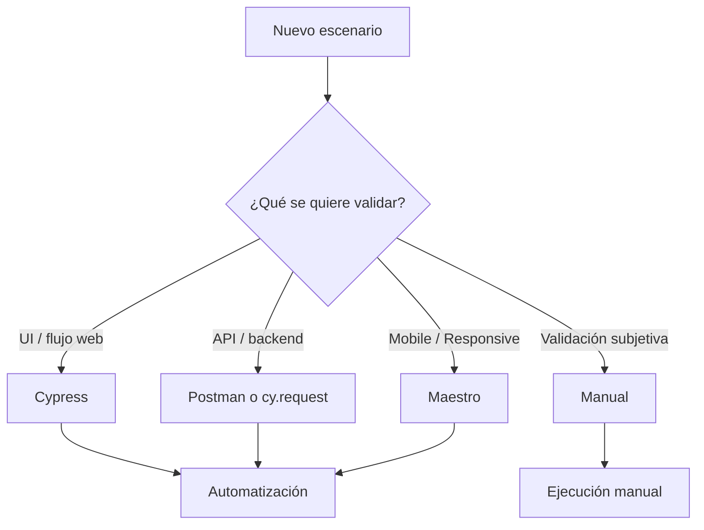
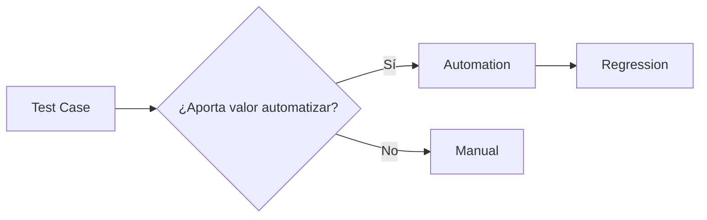
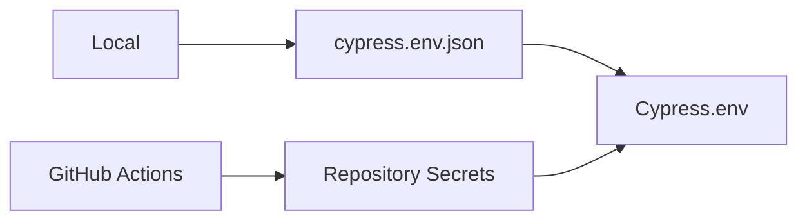
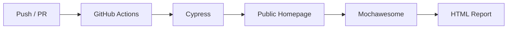

# Test Strategy — Shady Meadows B&B

## 1. Objetivo

Esta estrategia define cómo se planifican, ejecutan y automatizan las pruebas del proyecto **Shady Meadows B&B QA Portfolio**.

El objetivo principal es validar el comportamiento de la aplicación desde diferentes niveles y mantener una cobertura clara, trazable y mantenible.

---

## 2. Alcance

El proyecto combina pruebas sobre:

- interfaz web;
- navegación;
- formularios;
- habitaciones;
- reservas;
- autenticación;
- APIs;
- persistencia de datos;
- comportamiento responsive;
- flujos mobile;
- manejo de errores;
- integración UI ↔ API.

La cobertura se amplía progresivamente a medida que avanzan las distintas áreas funcionales del proyecto.

---

## 3. Enfoque de testing

No todos los escenarios se prueban de la misma forma.

La herramienta y el tipo de prueba se eligen según el comportamiento que se necesita validar.



---

## 4. Tipos de prueba utilizados

| Tipo | Uso |
| --- | --- |
| **Functional Testing** | Validar que una funcionalidad cumpla el comportamiento esperado |
| **E2E Testing** | Validar flujos completos desde la interfaz |
| **API Testing** | Validar status codes, responses, datos y persistencia |
| **Integration Testing** | Comprobar correspondencia entre UI y backend |
| **Negative Testing** | Validar datos inválidos y estados inesperados |
| **Boundary Testing** | Validar valores mínimos, máximos y límites |
| **Responsive Testing** | Validar comportamiento en distintos tamaños de pantalla |
| **Mobile Testing** | Validar flujos sobre dispositivos o simuladores móviles |
| **Regression Testing** | Reejecutar escenarios automatizados para detectar cambios no deseados |

---

## 5. Diseño de Test Cases

Los Test Cases se diseñan a partir del comportamiento esperado de cada funcionalidad.

Se busca:

- evitar escenarios duplicados;
- agrupar casos relacionados cuando sea posible;
- separar validaciones con objetivos distintos;
- utilizar datos claros y reproducibles;
- mantener trazabilidad con defectos encontrados.

Las técnicas de diseño se documentan únicamente cuando realmente aplican.

Ejemplos utilizados en el proyecto:

- **Partición de equivalencia**
- **Análisis de valores límite**

No se añade una técnica de diseño de forma automática si el escenario no la necesita.

---

## 6. Automatización

La automatización se utiliza cuando aporta valor en:

- regresión;
- repetibilidad;
- validaciones frecuentes;
- flujos críticos;
- escenarios con múltiples combinaciones;
- comprobaciones UI ↔ API.

No todos los Test Cases se automatizan.

Algunas validaciones permanecen manuales cuando dependen principalmente de:

- claridad visual;
- percepción del usuario;
- experiencia de uso;
- interpretación subjetiva.



---

## 7. Cypress

Cypress es la herramienta principal para automatización web.

Se utiliza para:

- UI Testing;
- E2E;
- formularios;
- navegación;
- pruebas negativas;
- valores límite;
- interceptación de requests;
- simulación de errores;
- validación de responses;
- consultas API mediante `cy.request()`.

La suite utiliza:

- Page Objects;
- comandos reutilizables;
- utilidades;
- datos dinámicos;
- intercepts;
- variables de entorno.

---

## 8. Maestro

Maestro se utiliza para pruebas mobile y responsive cuando el comportamiento del dispositivo aporta valor adicional.

Actualmente se usa principalmente para:

- navegación mobile;
- menús responsive;
- validaciones sobre simuladores iOS;
- comprobaciones en diferentes tamaños de pantalla.

---

## 9. API Testing

Postman se utiliza como herramienta de apoyo para validar directamente los servicios de la aplicación.

Se utiliza para:

- ejecutar requests;
- validar status codes;
- revisar response bodies;
- comprobar estructuras;
- verificar persistencia;
- apoyar investigaciones de bugs;
- generar evidencias.

Cypress también realiza validaciones API cuando forman parte de un flujo automatizado mediante:

```javascript
cy.request()
```

La consolidación de las requests en una colección Postman versionada y su ejecución con Newman forma parte de futuras entregas.

---

## 10. Datos de prueba

Siempre que sea posible se utilizan datos dinámicos para reducir:

- colisiones entre ejecuciones;
- dependencia de registros anteriores;
- IDs hardcodeados;
- falsos positivos o negativos.

Ejemplos:

```text
Nombre dinámico
Email dinámico
Subject dinámico
IDs obtenidos desde la API
Fechas calculadas durante la ejecución
```

Los identificadores creados o recuperados durante una prueba se obtienen dinámicamente cuando la aplicación lo permite.

---

## 11. Variables de entorno

Las credenciales y datos sensibles no se almacenan directamente dentro de los tests.

Localmente se utiliza:

```text
cypress.env.json
```

Este archivo está excluido del repositorio mediante `.gitignore`.

El repositorio incluye:

```text
cypress.env.example.json
```

como referencia de configuración.

En GitHub Actions las credenciales se almacenan mediante **Repository Secrets**.



---

## 12. Gestión de defectos

Cuando un Test Case no cumple el resultado esperado:

```text
Test Case
   ↓
Failed
   ↓
Bug
   ↓
Evidence
```

Cada bug documentado incluye información suficiente para reproducir y comprender el defecto.

Las evidencias permanentes se almacenan en:

```text
docs/evidence/
```

Las grabaciones de mayor tamaño pueden mantenerse externamente y enlazarse desde el bug correspondiente.

---

## 13. Bugs conocidos y automatización

Un test automatizado puede permanecer en estado **Failed** cuando reproduce un bug conocido.

La prueba sigue validando el comportamiento esperado y no se modifica para aceptar un comportamiento defectuoso.

Esto permite detectar cuándo el bug deja de reproducirse.

Los bugs conocidos no se consideran automáticamente errores de la automatización.

---

## 14. Continuous Integration

GitHub Actions ejecuta automáticamente Cypress después de:

- `push` a `main`;
- Pull Requests hacia `main`;
- ejecución manual del workflow.

Actualmente CI está limitado a:

```text
cypress/e2e/public/homepage/
```

porque otras áreas del proyecto siguen en desarrollo.



La cobertura de CI se ampliará progresivamente a Booking, Admin y futuras áreas a medida que se complete su implementación.

---

## 15. Reporting

Las ejecuciones Cypress generan reportes mediante **Mochawesome**.

El reporte incluye:

- tests ejecutados;
- Passed;
- Failed;
- duración;
- suites;
- errores;
- screenshots generados durante fallos.

Localmente:

```text
cypress/reports/index.html
```

Antes de cada nueva ejecución se eliminan los reportes y screenshots anteriores.

En GitHub Actions el reporte se guarda como un artifact temporal durante **2 días**.

Los reportes no se versionan en el repositorio.

---

## 16. Evidencia vs reporte de automatización

La evidencia de bugs y los reportes de Cypress tienen objetivos diferentes.

| Elemento | Objetivo | Permanencia |
| --- | --- | --- |
| `docs/evidence/` | Evidencia oficial del defecto | Permanente |
| Mochawesome local | Resultado de la última ejecución | Temporal |
| Mochawesome CI | Resultado de ejecución automática | 2 días |
| Cypress screenshots | Apoyo para debugging | Temporal |

---

## 17. Criterios generales de calidad

Durante el proyecto se busca:

- mantener tests independientes;
- evitar duplicación;
- evitar datos hardcodeados;
- utilizar selectores estables cuando sea posible;
- mantener documentación y automatización alineadas;
- separar pruebas manuales y automatizadas;
- documentar defectos reproducibles;
- mantener trazabilidad;
- automatizar solo cuando aporta valor;
- ampliar regresión progresivamente.

---

## 18. Estado de la estrategia

> 🚧 **Proyecto en curso**

La estrategia evoluciona junto con el proyecto.

Próximas mejoras previstas:

- ampliar cobertura de Booking;
- incorporar Admin a CI;
- consolidar colección Postman;
- ejecutar APIs con Newman;
- ampliar la suite de regresión;
- revisar y ajustar la estrategia según crezca el repositorio.