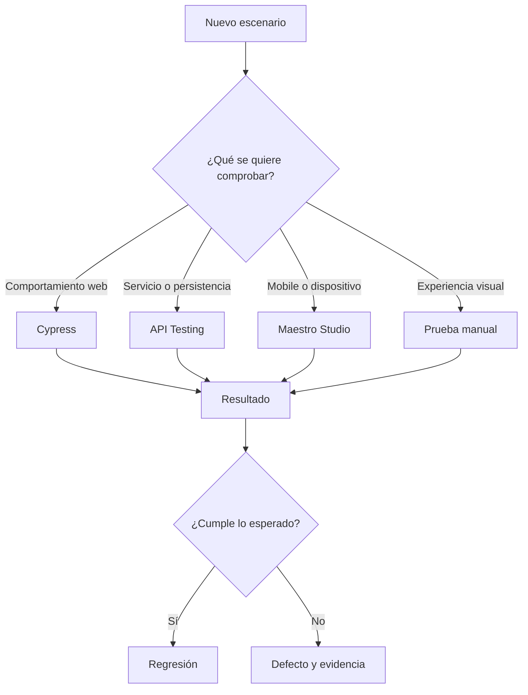
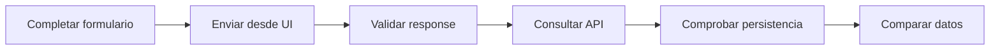
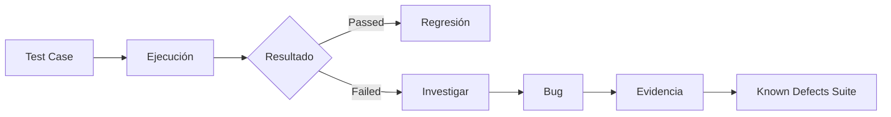
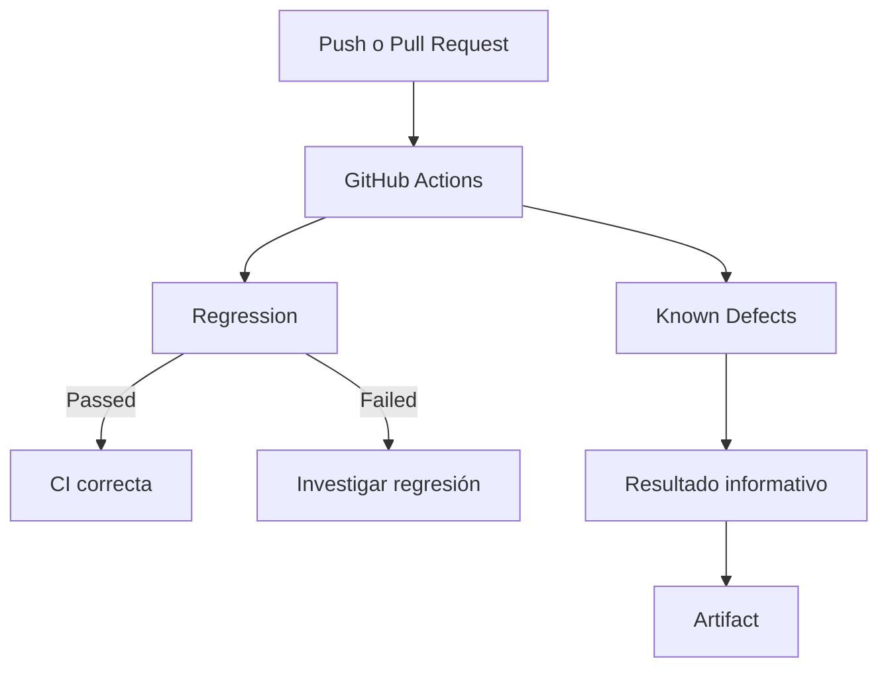
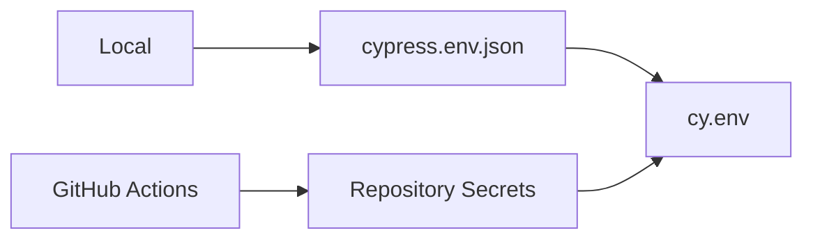

# Test Strategy — Shady Meadows B&B

## 1. Propósito

Esta estrategia explica cómo se planifican, diseñan, ejecutan y mantienen las pruebas del proyecto **Shady Meadows B&B QA Portfolio**.

El objetivo es aplicar un proceso de calidad que permita:

- validar el comportamiento de la aplicación;
- detectar regresiones;
- identificar y documentar defectos;
- comprobar la integración entre interfaz y API;
- mantener pruebas claras y repetibles;
- generar evidencia útil para analizar resultados.

El proyecto se desarrolla de forma progresiva. La estrategia evoluciona a medida que se incorporan nuevas funcionalidades.

---

## 2. Aplicación bajo prueba

| Campo | Información |
| --- | --- |
| Aplicación | Shady Meadows B&B |
| Plataforma | Web responsive |
| URL | `https://automationintesting.online/` |
| Tipo de entorno | Entorno público y compartido de práctica |
| Frontend | Aplicación web |
| Backend | API REST |
| Automatización principal | Cypress |
| Mobile y responsive | Maestro Studio |
| Integración continua | GitHub Actions |
| Reporting | Mochawesome |

La aplicación es un entorno compartido. Otros usuarios pueden crear, modificar o eliminar información.

Esto puede afectar temporalmente:

- habitaciones;
- reservas;
- mensajes;
- imágenes externas;
- datos administrativos;
- resultados obtenidos directamente desde la API.

Cuando el estado compartido puede producir resultados inestables, se documenta la limitación y se utilizan simulaciones controladas cuando aportan mayor fiabilidad.

---

## 3. Objetivos de calidad

La estrategia busca comprobar que:

- las funcionalidades principales estén disponibles;
- la información mostrada sea correcta;
- la navegación lleve al destino esperado;
- los formularios acepten datos válidos;
- los datos inválidos sean rechazados;
- los límites se procesen correctamente;
- los errores del backend no bloqueen la interfaz;
- la información de UI y API sea consistente;
- los datos enviados puedan verificarse en backend;
- los defectos conocidos continúen siendo reproducibles;
- las regresiones nuevas sean detectadas automáticamente.

---

## 4. Alcance actual

### SMB-1 — Homepage pública y habitaciones

Incluye:

- branding;
- información del hotel;
- navegación;
- catálogo de habitaciones;
- imágenes;
- enlaces;
- mapa y ubicación;
- comportamiento responsive;
- estados incompletos o vacíos.

### SMB-2 — Formulario de contacto

Incluye:

- envío con datos válidos;
- persistencia del mensaje;
- campos obligatorios;
- formatos inválidos;
- análisis de valores límite;
- respuestas de error;
- feedback mostrado al usuario;
- integración UI ↔ API.

### Áreas en desarrollo

| Área | Funcionalidad | Estado |
| --- | --- | --- |
| **SMB-3** | Disponibilidad y reservas | En desarrollo |
| **SMB-4** | Autenticación administrativa | En desarrollo |
| **SMB-5** | Reportes y ocupación | Próxima entrega |

Las áreas en desarrollo no se incorporan a la regresión principal hasta que sus pruebas sean suficientemente estables.

---

## 5. Enfoque de testing

La herramienta se elige según lo que se necesita validar.



No todos los escenarios deben automatizarse.

Una prueba se automatiza cuando aporta valor en:

- regresión;
- repetibilidad;
- validaciones frecuentes;
- flujos importantes;
- pruebas con múltiples combinaciones;
- simulación de errores;
- comparación entre UI y API.

Una prueba puede mantenerse manual cuando depende principalmente de:

- percepción visual;
- claridad del contenido;
- experiencia de usuario;
- comportamiento difícil de medir de forma fiable;
- interpretación humana.

---

## 6. Tipos de prueba

| Tipo | Objetivo |
| --- | --- |
| **Functional Testing** | Confirmar que una funcionalidad cumple el resultado esperado |
| **UI Testing** | Validar elementos, contenido, formularios y navegación |
| **E2E Testing** | Comprobar un flujo completo desde la interfaz hasta el backend |
| **API Testing** | Validar códigos HTTP, responses, estructuras y datos |
| **Integration Testing** | Comparar el comportamiento de la UI con la información del backend |
| **Negative Testing** | Comprobar datos inválidos y situaciones inesperadas |
| **Boundary Testing** | Validar valores mínimos, máximos y fuera de rango |
| **Responsive Testing** | Comprobar el comportamiento en diferentes tamaños de pantalla |
| **Mobile Testing** | Validar flujos en dispositivos o simuladores móviles |
| **Regression Testing** | Detectar cambios no deseados en funcionalidades estables |
| **Exploratory Testing** | Investigar comportamientos, riesgos y escenarios no previstos |

---

## 7. Diseño de Test Cases

Los Test Cases se diseñan a partir de:

- User Stories;
- criterios de aceptación;
- comportamiento esperado;
- riesgos identificados;
- resultados de pruebas exploratorias;
- defectos encontrados anteriormente.

Cada Test Case debe tener un objetivo claro y evitar comprobaciones que no estén relacionadas con ese objetivo.

Cuando aplica, se utilizan técnicas como:

### Partición de equivalencia

Los datos se agrupan según comportamientos equivalentes.

Ejemplo:

```text
Email válido
Email vacío
Email con formato inválido
```

### Análisis de valores límite

Se prueban valores cercanos a los límites permitidos.

Ejemplo:

```text
Mínimo - 1
Mínimo
Máximo
Máximo + 1
```

### Transición de estados

Se comprueba cómo cambia la aplicación después de una acción.

Ejemplo:

```text
Formulario vacío
    ↓
Enviar
    ↓
Mostrar errores
```

### Error guessing

Se prueban situaciones basadas en experiencia y riesgos conocidos.

Ejemplos:

- endpoints que devuelven objetos incompletos;
- imágenes inexistentes;
- enlaces con destinos vacíos;
- servicios que responden HTTP 500;
- rutas no existentes.

---

## 8. Datos de prueba

Siempre que sea posible se utilizan datos dinámicos.

Ejemplos:

```text
Nombre con timestamp
Email único
Subject único
ID obtenido desde API
Datos generados durante la ejecución
```

Esto ayuda a reducir:

- colisiones entre ejecuciones;
- dependencia de registros anteriores;
- IDs hardcodeados;
- falsos resultados;
- conflictos con otros usuarios.

Los datos compartidos no se consideran completamente estables. Una prueba que dependa del estado real del entorno debe tener en cuenta que ese estado puede cambiar durante la ejecución.

---

## 9. Automatización con Cypress

Cypress es la herramienta principal para automatización web.

Se utiliza para:

- interactuar con la interfaz;
- validar elementos y contenido;
- comprobar navegación;
- completar formularios;
- interceptar requests;
- simular responses;
- consultar endpoints;
- verificar persistencia;
- comparar UI y API.

La automatización utiliza:

- Page Objects;
- comandos personalizados;
- utilidades reutilizables;
- datos dinámicos;
- aliases;
- `cy.intercept()`;
- `cy.request()`;
- variables de entorno.

La prioridad es mantener pruebas:

- legibles;
- independientes;
- mantenibles;
- fáciles de investigar cuando fallan.

---

## 10. Simulación de escenarios

Algunos estados son difíciles de reproducir de forma natural. Para estos casos se utilizan interceptaciones controladas.

Ejemplos:

| Simulación | Objetivo |
| --- | --- |
| Objeto de branding incompleto | Comprobar la estabilidad de la homepage |
| Catálogo sin habitaciones | Validar el empty state |
| Imagen con HTTP 404 | Comprobar el comportamiento ante un recurso roto |
| Servicio con HTTP 500 | Validar la gestión de errores |
| Response con datos incompletos | Comprobar cómo se representa la información |

Las simulaciones deben reproducir un escenario realista y mantener un resultado verificable.

No se utilizan únicamente para conseguir que un test pase.

---

## 11. API Testing

La API se valida de dos formas.

### Cypress

Se utiliza `cy.request()` cuando la validación del backend forma parte del mismo flujo automatizado.

Ejemplo:



### Postman

Postman se utiliza como herramienta de apoyo para:

- explorar endpoints;
- comprobar responses;
- investigar defectos;
- validar estructuras;
- preparar datos;
- generar evidencias.

La creación de una colección versionada y su ejecución mediante Newman forman parte del roadmap.

---

## 12. Mobile y responsive con Maestro Studio

Maestro Studio se utiliza para validar comportamientos que dependen del dispositivo o del tamaño de pantalla.

Actualmente se aplica a:

- navegación mobile;
- menú responsive;
- acceso a secciones;
- comportamiento después de una interacción;
- pruebas sobre simuladores iOS.

Las coordenadas o acciones dependientes del dispositivo deben mantenerse separadas cuando un mismo flujo no sea fiable en diferentes tamaños de pantalla.

---

## 13. Organización de las suites

La automatización está separada según el propósito de cada prueba.

### Regression Suite

Ruta:

```text
cypress/e2e/public/homepage/
```

Contiene escenarios estables.

Estos tests deben pasar. Un fallo puede indicar:

- una regresión;
- un cambio en la aplicación;
- una caída del entorno;
- datos compartidos inesperados;
- un problema en la automatización.

### Known Defects Suite

Ruta:

```text
cypress/e2e/known-defects/homepage/
```

Contiene escenarios relacionados con defectos ya identificados.

| Suite | Objetivo | Comportamiento en CI |
| --- | --- | --- |
| **Regression** | Detectar regresiones nuevas | Bloqueante |
| **Known Defects** | Mantener defectos reproducibles | No bloqueante |

Los tests de defectos mantienen el resultado esperado del producto. No se modifican para aceptar un comportamiento incorrecto.

Cuando uno de estos tests deja de fallar:

1. Se vuelve a ejecutar.
2. Se revisa manualmente el comportamiento.
3. Se confirma si el defecto fue corregido.
4. Se actualiza su documentación.
5. El escenario puede trasladarse a regresión.

Un test que pasa no cierra automáticamente un defecto. Siempre se realiza una comprobación antes de cambiar su estado.

---

## 14. Gestión de defectos

Cuando el resultado actual no coincide con el esperado, se analiza si existe un defecto.



Cada bug debe incluir, cuando corresponda:

- descripción;
- relación con Epic y Test Case;
- precondiciones;
- datos utilizados;
- pasos para reproducir;
- resultado actual;
- resultado esperado;
- severidad;
- prioridad;
- entorno;
- evidencia;
- recomendación.

### Severidad y prioridad

La severidad representa el impacto técnico o funcional.

La prioridad indica la urgencia con la que debería resolverse.

Un defecto puede tener severidad baja y prioridad alta si afecta de forma frecuente a la experiencia del usuario.

---

## 15. Trazabilidad

La documentación mantiene relación entre:

```text
Epic
  ↓
User Story
  ↓
Acceptance Criteria
  ↓
Test Case
  ↓
Resultado
  ↓
Bug
  ↓
Evidence
```

La trazabilidad permite conocer:

- qué requisito se está validando;
- qué caso detectó un defecto;
- qué evidencia demuestra el resultado;
- qué prueba automatizada cubre el escenario.

Los identificadores `SMB-*` y `TC*` se utilizan para mantener esta relación.

---

## 16. Continuous Integration

GitHub Actions ejecuta las pruebas automáticamente después de:

- un `push` a `main`;
- un Pull Request hacia `main`;
- una ejecución manual.

El workflow contiene dos jobs independientes.

### Public Homepage Regression

Ejecuta:

```text
cypress/e2e/public/homepage/
```

Este job es bloqueante. Si falla, CI se marca como fallida.

### Known Defects

Ejecuta:

```text
cypress/e2e/known-defects/homepage/
```

Este job es informativo y no bloqueante.

Los fallos esperados no impiden que la regresión principal quede verde.



---

## 17. Criterios de entrada

Antes de ejecutar una suite se comprueba que:

- la aplicación esté disponible;
- el entorno permita acceder a la funcionalidad;
- las dependencias estén instaladas;
- las variables necesarias estén configuradas;
- los datos mínimos estén disponibles;
- el navegador requerido pueda iniciarse.

Para áreas administrativas también se necesitan credenciales configuradas mediante variables de entorno.

---

## 18. Criterios de salida

Una ejecución de regresión se considera satisfactoria cuando:

- todos los tests de regresión pasan;
- no existen errores inesperados de configuración;
- el reporte se genera correctamente;
- los fallos del entorno han sido analizados;
- no se detectan regresiones nuevas.

La suite de defectos conocidos se considera correctamente ejecutada cuando:

- todos los specs se ejecutan;
- los resultados esperados quedan registrados;
- el reporte se genera;
- los cambios de comportamiento son revisados.

---

## 19. Variables de entorno

Las credenciales y valores sensibles no se almacenan directamente en los tests.

En local se utiliza:

```text
cypress.env.json
```

Este archivo está excluido mediante `.gitignore`.

El repositorio incluye:

```text
cypress.env.example.json
```

como referencia.

Los valores sensibles se obtienen mediante:

```javascript
cy.env(['adminUsername', 'adminPassword'])
```

En GitHub Actions se utilizan Repository Secrets.



Los valores sensibles no deben imprimirse en logs, errores ni reportes.

---

## 20. Reporting y evidencias

Las ejecuciones Cypress generan reportes mediante Mochawesome.

El reporte local:

```text
cypress/reports/index.html
```

incluye:

- tests ejecutados;
- resultados Passed y Failed;
- duración;
- suites;
- mensajes de error;
- screenshots asociados a fallos.

GitHub Actions genera artifacts independientes:

```text
regression-mochawesome-report
known-defects-mochawesome-report
```

Los artifacts son temporales y se conservan durante dos días.

### Diferencia entre reporte y evidencia

| Elemento | Objetivo | Conservación |
| --- | --- | --- |
| `docs/evidence/` | Demostrar un defecto documentado | Permanente |
| Mochawesome local | Analizar la última ejecución | Temporal |
| Mochawesome CI | Revisar una ejecución automática | Temporal |
| Cypress screenshots | Facilitar la investigación de fallos | Temporal |

---

## 21. Mantenimiento de las pruebas

Cuando cambia la aplicación se revisa:

- si el comportamiento esperado cambió;
- si el selector continúa siendo estable;
- si la documentación sigue siendo correcta;
- si el escenario pertenece a regresión;
- si un defecto conocido fue corregido;
- si la prueba sigue aportando valor.

No se cambia una expectativa únicamente para conseguir que un test pase.

Primero se determina si cambió:

- el requisito;
- la aplicación;
- el entorno;
- los datos;
- o la automatización.

---

## 22. Riesgos y limitaciones

| Riesgo | Tratamiento |
| --- | --- |
| Entorno compartido | Utilizar datos dinámicos y analizar diferencias temporales |
| Datos modificados por otros usuarios | Evitar depender de cantidades o IDs fijos |
| Servicios externos | Registrar claramente el recurso afectado |
| Defectos conocidos | Ejecutarlos en una suite no bloqueante |
| Errores difíciles de reproducir | Utilizar interceptaciones controladas |
| Credenciales | Gestionarlas mediante variables y secretos |
| Tests en desarrollo | No incorporarlos a regresión hasta estabilizarlos |

---

## 23. Criterios generales de calidad

Durante el proyecto se busca:

- mantener tests independientes;
- evitar duplicación innecesaria;
- utilizar nombres claros;
- mantener comentarios breves y útiles;
- evitar esperas fijas;
- reducir datos hardcodeados;
- utilizar selectores estables;
- mantener documentación y automatización alineadas;
- separar regresión y defectos conocidos;
- conservar evidencia reproducible;
- automatizar cuando aporta valor;
- investigar los fallos antes de modificar una expectativa.

---

## 24. Estado y evolución

La estrategia está en desarrollo continuo.

Próximas mejoras:

- ampliar la cobertura de reservas;
- completar autenticación administrativa;
- incorporar accesibilidad automatizada;
- versionar una colección Postman;
- ejecutar pruebas API mediante Newman;
- añadir ESLint y Prettier;
- fijar la versión de Node.js;
- ampliar las validaciones de CI;
- revisar periódicamente la trazabilidad.

Los resultados actuales y el estado funcional del proyecto se mantienen actualizados en el [`README.md`](../README.md).